# Software Architecture

## Deliverables Kelompok

### Context Diagram
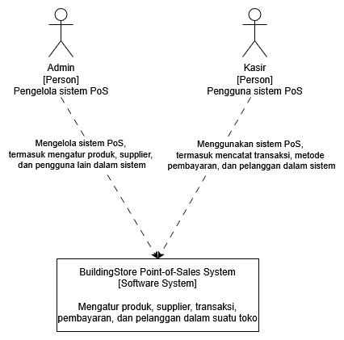
### Container Diagram
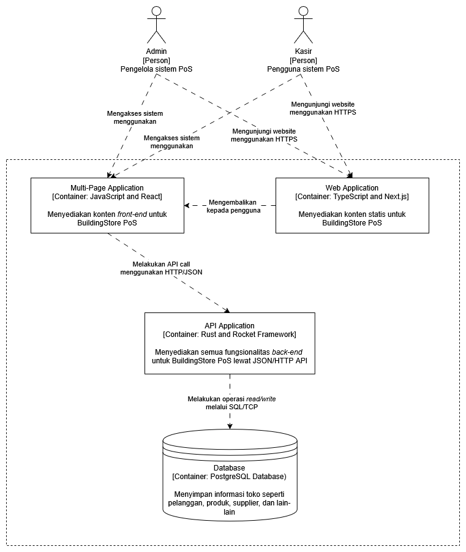
### Deployment Diagram
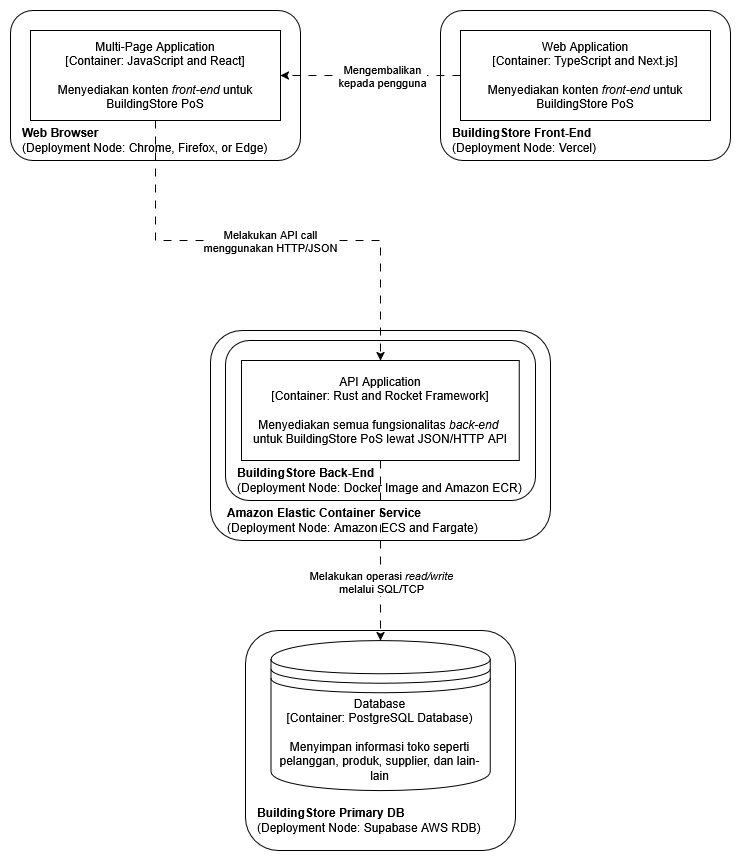
### Risk Storming - Identification
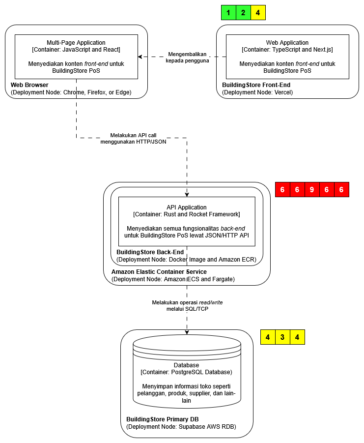
### Risk Storming - Consensus
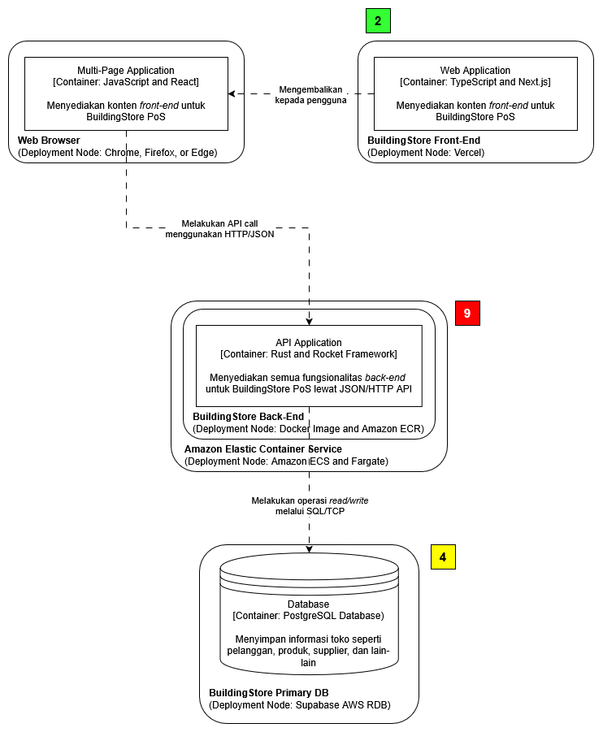
### Future Context Diagram
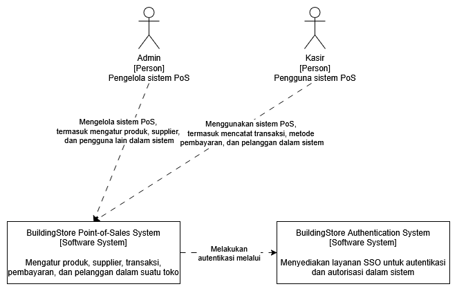
### Future Container Diagram
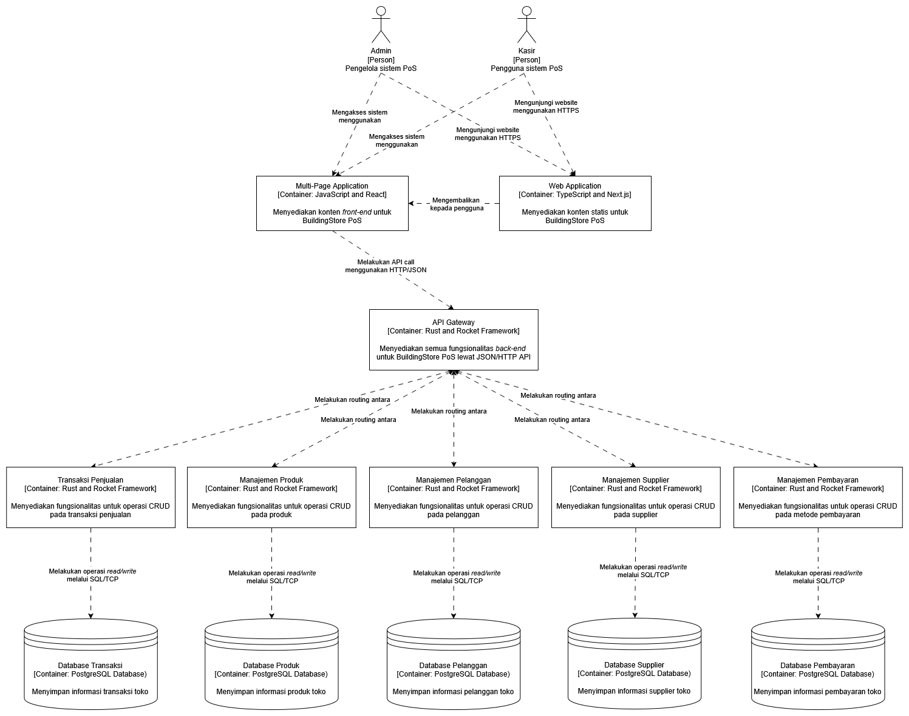

### Risk Storming and Future Architecture Explanation
Berikut adalah hasil dari Risk Storming yang dilakukan kelompok kami. Pertama, pada tahap identifikasi, tiga partisipan memberi nilai risiko 6 dan dua partisipan memberi nilai risiko 9 kepada komponen API application back-end. Alasan mayoritas memberikan risiko tinggi kepada komponen ini adalah arsitektur monolitik pada backend membuat seluruh aplikasi memiliki single point of failure, sehingga jika terdapat masalah pada backend maka semua layanan akan ikut bermasalah. 

Sementara itu, satu partisipan memberi nilai risiko 3 dan dua partisipan memberi nilai risiko 4 kepada komponen database dengan alasan yang serupa: jika database mengalami downtime maka seluruh aplikasi akan mengalami downtime. Tidak adanya database backup juga berpotensi merugikan jika terjadi kehilangan data pada database primary. Namun, kemungkinan dari downtime database dan kerusakan data dinilai cukup rendah sehingga tidak termasuk dalam risiko tinggi. 

Terakhir, satu partisipan memberi nilai risiko 1, satu partisipan memberi nilai risiko 2, dan satu partisipan memberi nilai risiko 4 kepada komponen web application front-end. Dua partisipan pertama memberi nilai risiko rendah karena komponen tersebut dinilai low risk dan load pada front-end dianggap relatif lebih rendah dari komponen-komponen lain. Partisipan terakhir memberi nilai risiko sedang dengan alasan serupa dengan backend dan database (single point of failure), namun akhirnya setuju dengan partisipan lain.

Mitigasi yang dilakukan kelompok kami adalah menerapkan arsitektur microservices dan memisahkan layanan-layanan yang ada, termasuk database yang digunakan. Hal ini akan membantu meningkatkan scalability dan availability dari layanan BuildingStore, karena jika satu layanan mengalami downtime, layanan yang lain tetap dapat digunakan seperti biasa. Pemisahan database juga berguna untuk menghindari pencurian ataupun kerusakan data pada seluruh aplikasi. Kemudian, sistem autentikasi diubah menjadi software system baru yang terpisah untuk meningkatkan security dan juga scalability jika ingin dikembangkan software system lain menggunakan autentikasi yang sudah ada (SSO). Tradeoff dari solusi ini adalah perlunya biaya dan waktu tambahan untuk mengubah arsitektur yang sudah ada, dan biaya tambahan untuk mengelola database dan layanan terpisah.

## Deliverables Individu
### Joshua (Manajemen Pelanggan)
#### Component Diagram
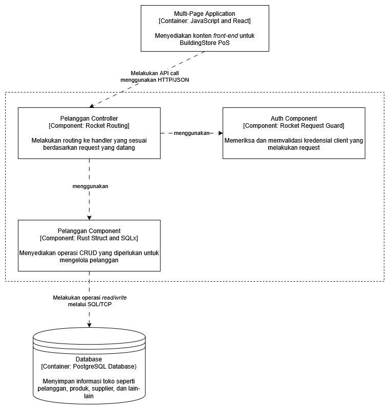
#### Code Diagram
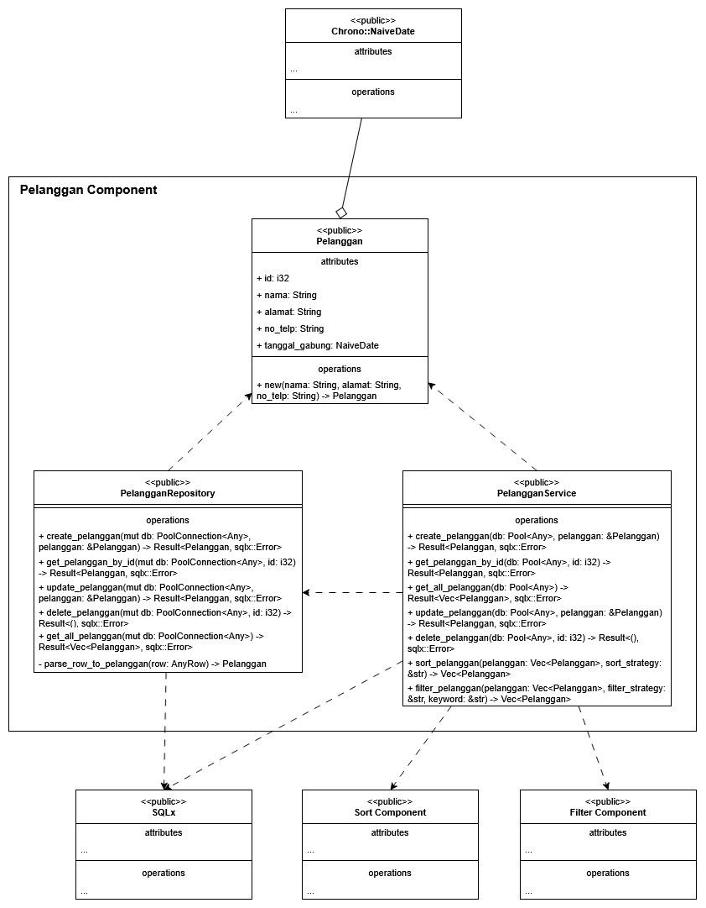

### Scafi (Manajemen Pembayaran)
#### Component Diagram
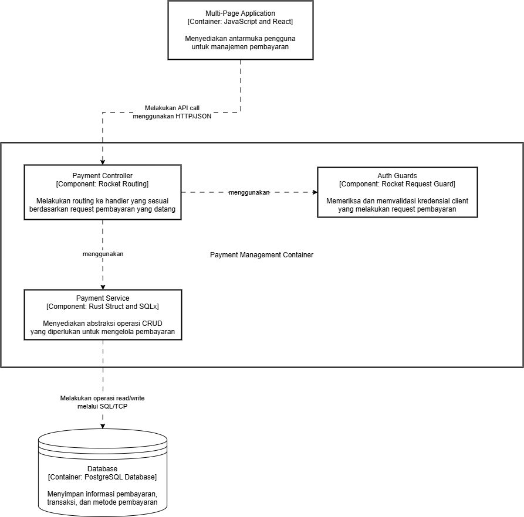
#### Code Diagram
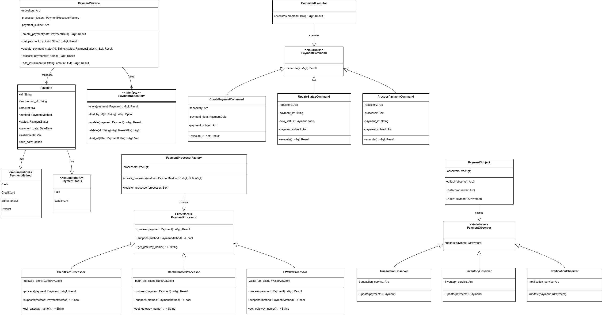

### Brenda (Transaksi Penjualan)
#### Component Diagram
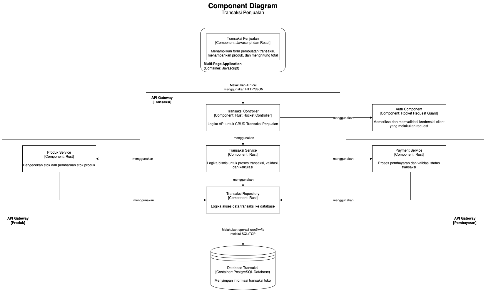

#### Code Diagram
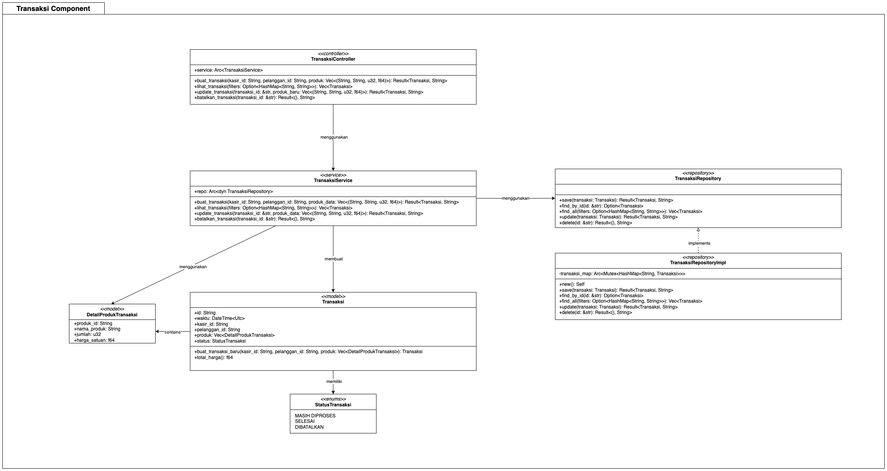

### Fathur (Manajemen Supplier)
#### Component Diagram
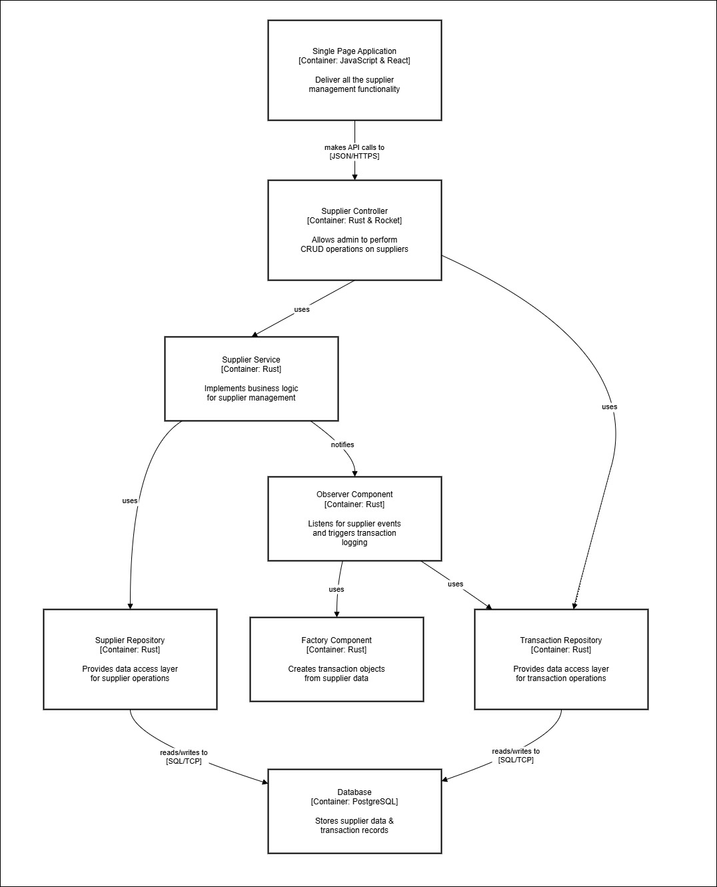
#### Code Diagram
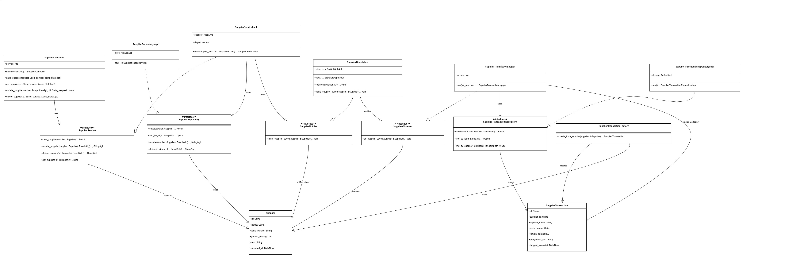

### Fachri (Manajemen Produk)
#### Component Diagram
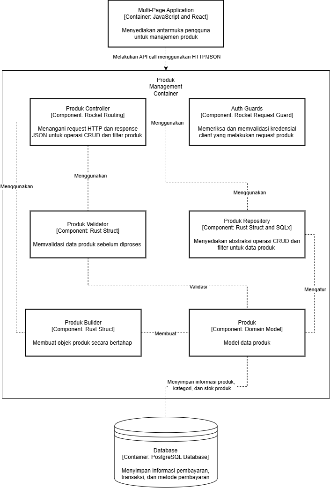
#### Code Diagram
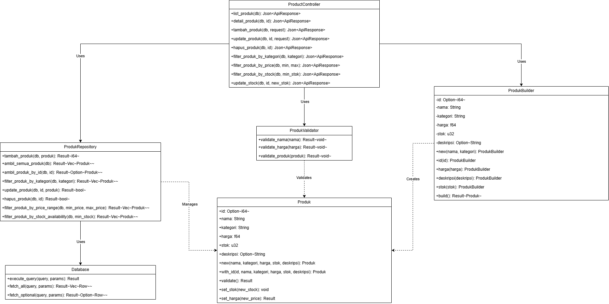
